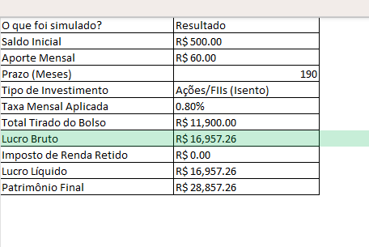

# Simulador Financeiro Interativo: O Poder dos Juros Compostos

## Sobre o Projeto
Este projeto é uma aplicação interativa desenvolvida em Python (Jupyter Notebook) que projeta a evolução patrimonial baseada em aportes mensais. O grande diferencial desta ferramenta é a fuga do "cenário ideal", implementando **regras reais de mercado** (como a tributação regressiva do Imposto de Renda) e um sistema robusto de tratamento de erros para a entrada de dados do usuário.

## Principais Funcionalidades
* **Prompt Interativo Robusto:** Coleta dinâmica de variáveis de entrada com validação de dados (`try/except`) para evitar quebras no sistema por erros de digitação.
* **Motor de Cálculo Iterativo:** Loop de processamento mês a mês para garantir precisão no cálculo de dividendos compostos.
* **Inteligência Tributária:** Aplicação automática da Tabela Regressiva do IR (15% a 22,5%) condicionada ao tipo de investimento e prazo de resgate.
* **Visualização de Dados (Data Viz):** Gráficos interativos gerados com Plotly, destacando a "zona de lucro" através da plotagem da área sob a curva.
* **Exportação Executiva (ETL):** Geração automatizada de relatórios em `.xlsx` utilizando XlsxWriter, estruturando os dados em formato de Tabela Oficial do Excel com abas de contexto e colunas autoajustadas.

### Resultados (Relatório Gerado no Excel)
Aqui estão exemplos reais do relatório executivo que o simulador gera automaticamente:

**1. Aba 'Resumo da Simulação'**
Mostra todos os parâmetros de entrada e os resultados finais de forma consolidada e executiva.



**2. Aba 'Histórico Mensal'**
Detalha a evolução mês a mês do patrimônio, mostrando o "efeito bola de neve" dos juros compostos com visual de Tabela Oficial do Excel.


## Tecnologias Utilizadas
* **Python 3**
* **Pandas:** Estruturação e manipulação da base de dados histórica.
* **Plotly (`graph_objects`):** Renderização da interface gráfica analítica.
* **XlsxWriter:** Injeção de formatação e estilos visuais nativos no Excel via código.

## Como Executar a Aplicação
1. Certifique-se de ter o Python instalado.
2. Instale as dependências executando no seu terminal:
   ```bash
   pip install pandas plotly xlsxwriter
   ```
3. Abra o arquivo do simulador em seu ambiente (VS Code ou Jupyter).
   
4. Execute as células sequencialmente. O sistema abrirá caixas de diálogo seguras para coleta de parâmetros.

5. O output será renderizado na tela (Gráfico Interativo) e um arquivo final chamado  ```Simulador_Completo_e_Formatado.xlsx ``` será salvo no diretório raiz.

## Autor
Daniel Aleixo
###
Profissional focado em soluções através da tecnologia e Ciência da Informação.
[LinkedIn](https://www.linkedin.com/in/daniel-souza-8075371bb/)
